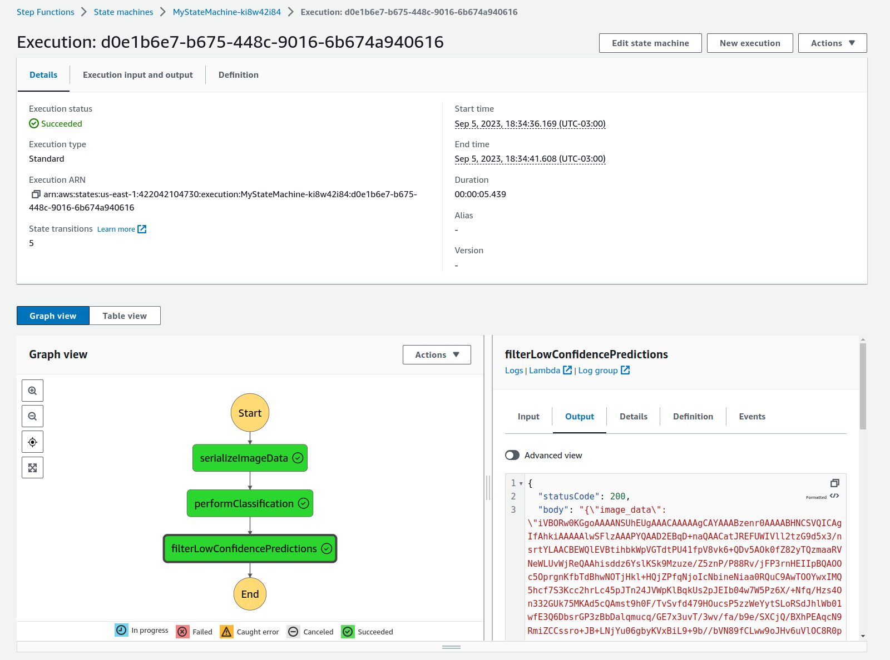

# AWS-Machine-Learning-Engineer-Project2
This is my second project for the AWS Machine Learning Engineering Nanodegree at Udacity.
Context:  
You are hired as a Machine Learning Engineer for a scone-delivery-focused logistics company, Scones Unlimited, and you’re working to ship an Image Classification model.   
You'll be building an image classification model that can automatically detect which kind of vehicle delivery drivers have, in order to route them to the correct loading bay and orders. Assigning delivery professionals who have a bicycle to nearby orders and giving motorcyclists orders that are farther can help Scones Unlimited optimize their operations.

In this project, I have:
1. used AWS Sagemaker to build an image classification model
2. deployed the model
3. built a Step Functions workflow using 3 lambda functions to simulate incoming classification requests. The workflow receives the payload, performs inference on it, and forwards it to downstream services in case the confidence level of the prediction is above the threshold.

